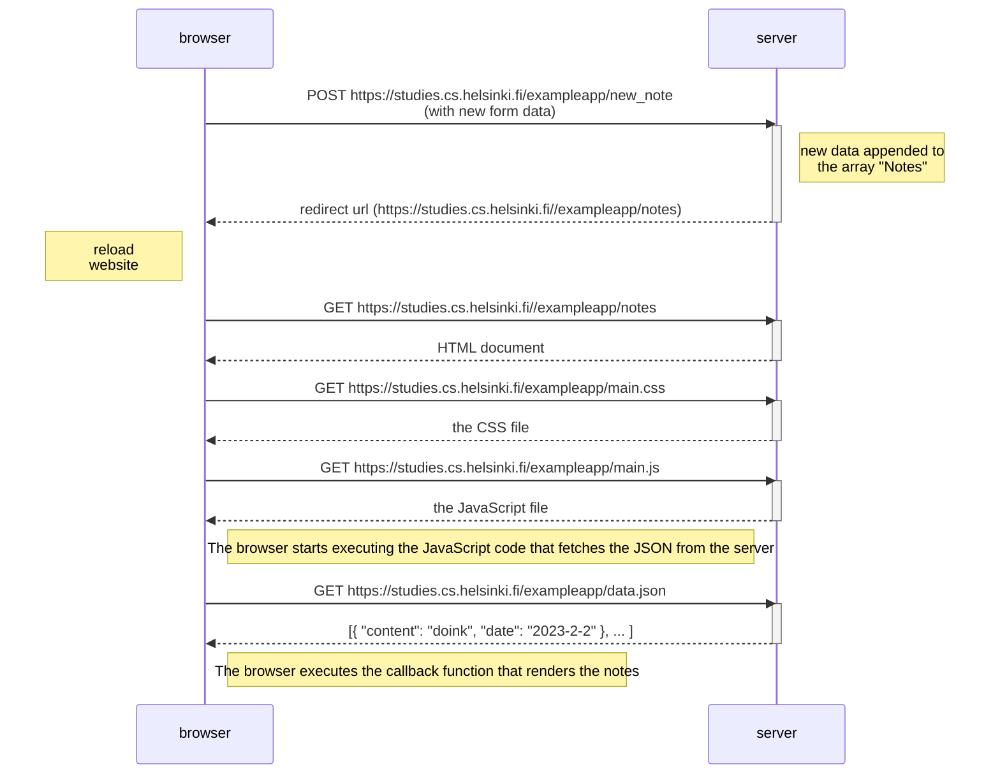

```mermaid

sequenceDiagram
    participant browser
    participant server
    
    browser->>server: POST https://studies.cs.helsinki.fi/exampleapp/new_note <br/> (with new form data)
    activate server
    note right of server: new data appended to <br/> the array "Notes"
    server-->>browser: redirect url (https://studies.cs.helsinki.fi//exampleapp/notes)
    deactivate server

    note left of browser:reload <br/>website
    browser->>server: GET https://studies.cs.helsinki.fi//exampleapp/notes
    activate server
    server-->>browser: HTML document
    deactivate server
    
    browser->>server: GET https://studies.cs.helsinki.fi/exampleapp/main.css
    activate server
    server-->>browser: the CSS file
    deactivate server
    
    browser->>server: GET https://studies.cs.helsinki.fi/exampleapp/main.js
    activate server
    server-->>browser: the JavaScript file
    deactivate server
    
    Note right of browser: The browser starts executing the JavaScript code that fetches the JSON from the server
    
    browser->>server: GET https://studies.cs.helsinki.fi/exampleapp/data.json
    activate server
    server-->>browser: [{ "content": "doink", "date": "2023-2-2" }, ... ]
    deactivate server    

    Note right of browser: The browser executes the callback function that renders the notes
```
