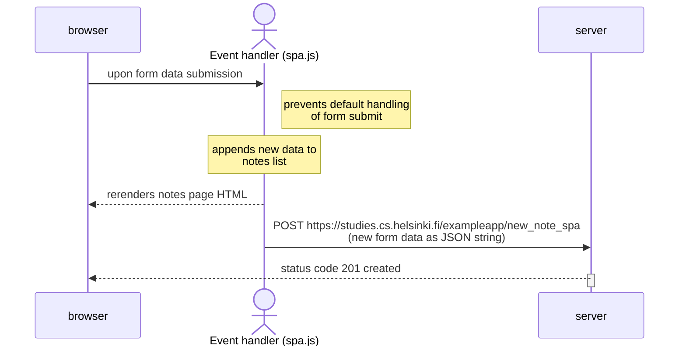

```mermaid


sequenceDiagram
    participant browser
    actor  Event handler (spa.js)
    participant server

    browser->>Event handler (spa.js): upon form data submission
    
    note right of Event handler (spa.js): prevents default handling <br/> of form submit
    note over Event handler (spa.js): appends new data to <br/> notes list
    Event handler (spa.js)-->> browser: rerenders notes page HTML
    Event handler (spa.js)->>server: POST https://studies.cs.helsinki.fi/exampleapp/new_note_spa <br/> (new form data as JSON string)
    server-->>browser: status code 201 created
    
    activate server
    deactivate server

```